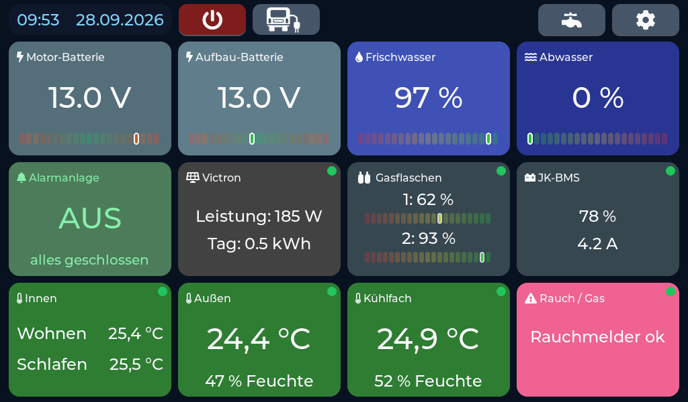
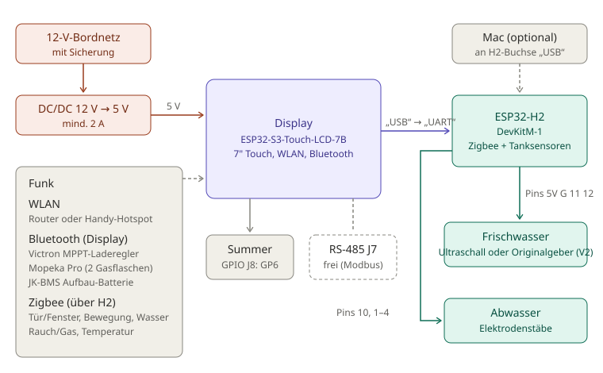
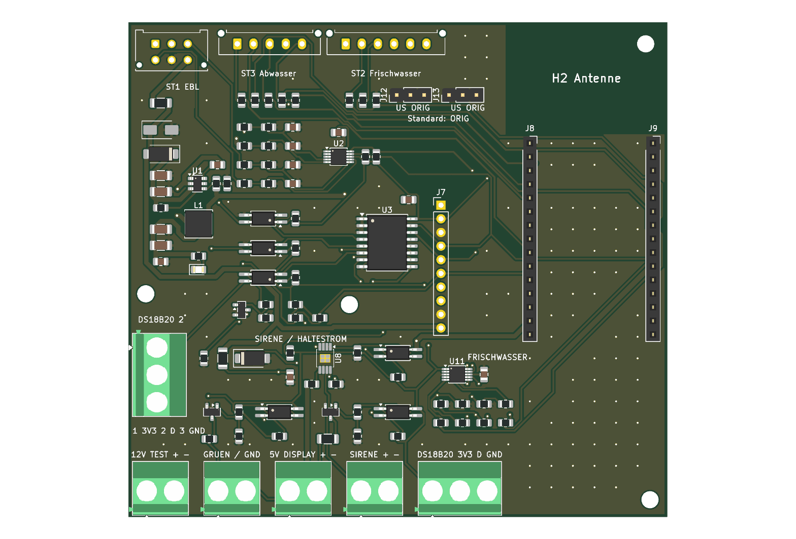
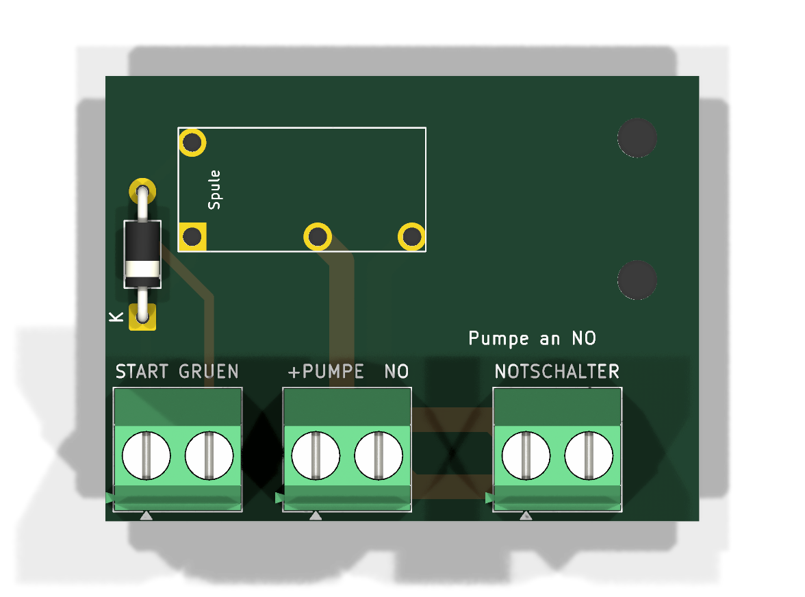
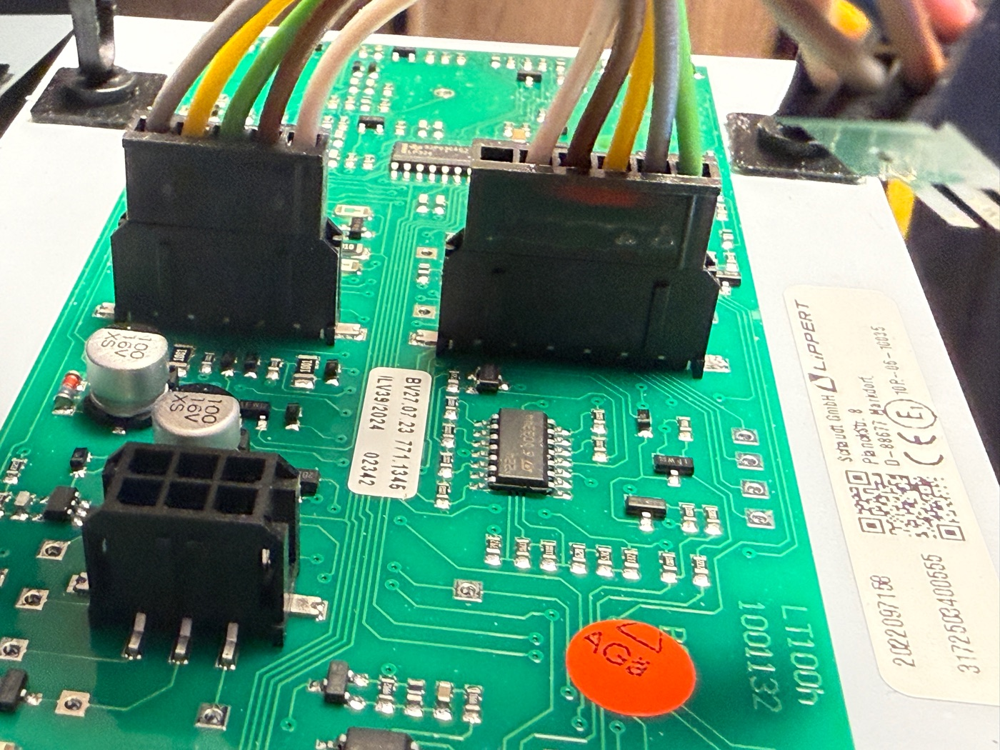
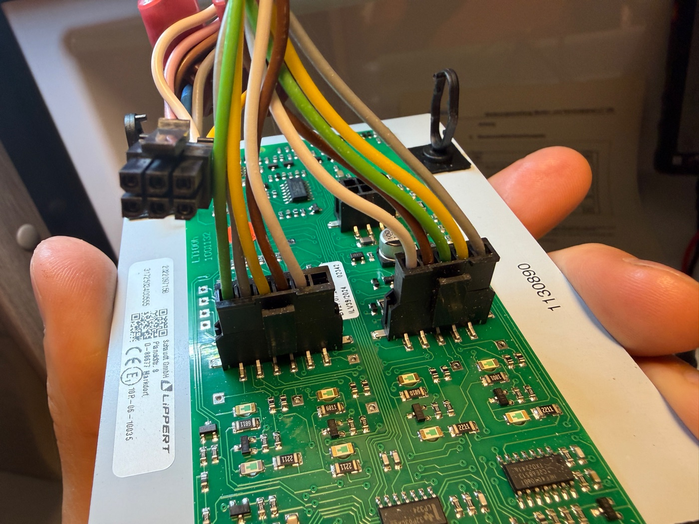
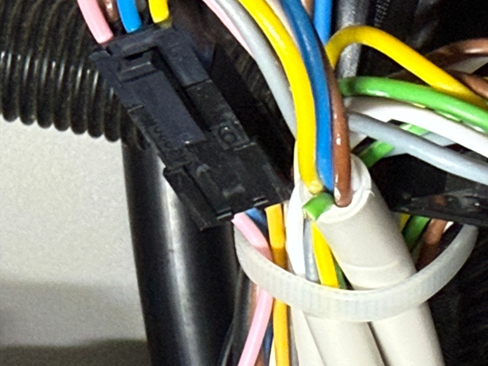
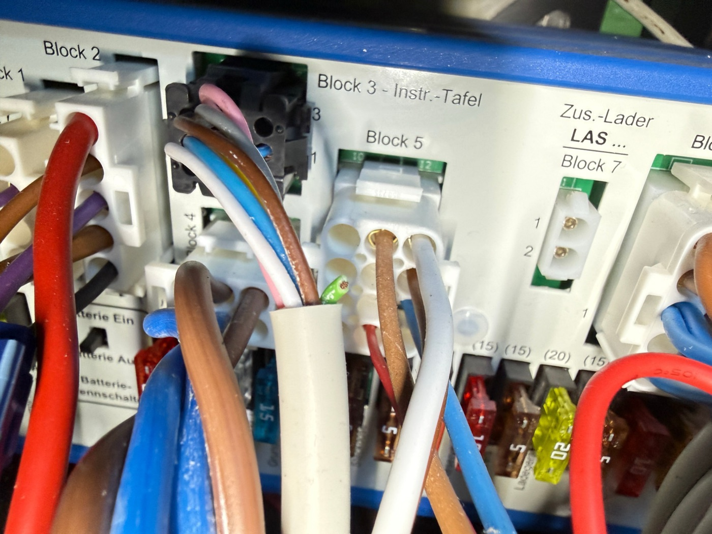
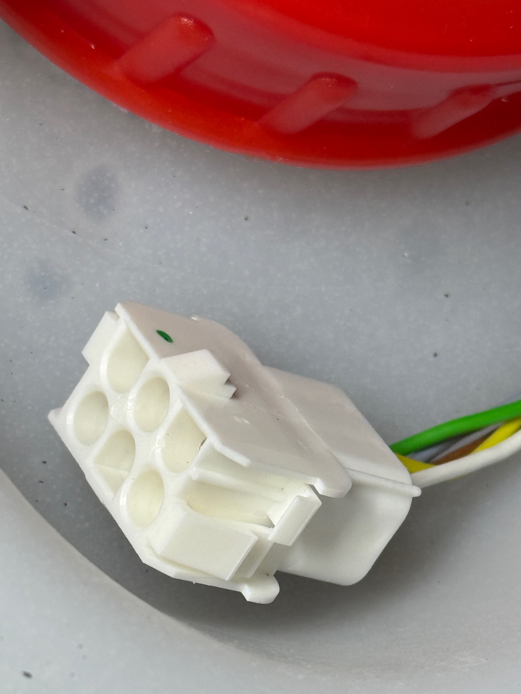
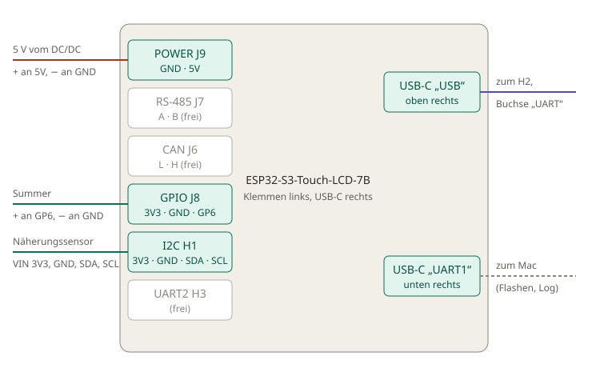

# Wohnmobil-Display – mit 72 Stunden Testzeit

Ein 7-Zoll-Touchdisplay für das Wohnmobil: Batterien, Frisch- und Abwasser, Gasflaschen, Solarregler,
Temperaturen, Alarmanlage mit Zigbee-Sensoren, Wasserpumpe und Push-Nachrichten aufs Handy – alles auf einen Blick.
Es ersetzt das originale Schaudt-Bedienteil **LT 100** und nutzt dessen **vorhandene Stecker und Kabel**.



**Inhalt:** [Funktionen](#funktionen) · [Bedienung](#bedienung) · [Hardware](#hardware) · [Einkaufsliste](#einkaufsliste) ·
[Installation](#1-installation) · [Testzeit](#2-erster-start-testzeit) · [Freischalten](#3-freischalten) · [Updates](#4-updates)

## Funktionen

| Bereich | Was das Display kann |
|---|---|
| **Batterien** | Motor- und Aufbau-Batterie, JK-BMS mit allen 12 Zellen, Temperaturen und Ladezustand (Bluetooth) |
| **Solar** | Victron-MPPT-Laderegler: Leistung, Tagesertrag, Verlauf der letzten 7 Tage (Bluetooth) |
| **Wasser** | Frischwasser über den Original-Geber oder Ultraschall, Abwasser über die Original-Elektrodenstäbe |
| **Pumpe** | Wasserpumpe per Fingertipp ein/aus, automatisch gesperrt bei scharfer Alarmanlage |
| **Gas** | Zwei Gasflaschen mit Mopeka-Pro-Sensoren in Prozent (Bluetooth) |
| **Temperatur** | Innen (Wohn- und Schlafbereich), außen, Kühlschrank – über Zigbee-Sensoren oder fest verbaute Fühler |
| **Alarmanlage** | Bis zu 12 Zigbee-Sensoren (Tür/Fenster, Bewegung, Wasser), Nachtmodus, Verlassens-/Eingangszeit, PIN, Summer, Sirene |
| **Rauch / Gas** | Zigbee-Melder, rund um die Uhr überwacht |
| **Landstrom** | Anzeige, ob 230 V anliegen |
| **Push-Nachrichten** | Alarm, Grenzwerte, schwache Batterien, Sensor offline – per Telegram aufs Handy |
| **Komfort** | Kachelnamen und Farben frei wählbar, Nachtabschaltung, Näherungssensor weckt das Display, Einstellen per Handy-Webseite |
| **Updates** | Neue Versionen per WLAN direkt am Display |

## Bedienung

Die komplette **[Bedienungsanleitung (PDF)](docs/Bedienungsanleitung.pdf)** zeigt jede Seite und jede Einstellung.

| Setup-Menü | Alarmanlage |
|---|---|
|  |  |

- **Startseite:** 12 Kacheln, oben Uhrzeit, Landstrom, Störmeldungen, Wasserpumpe und Setup.
- **Rote Kachel:** ein eingestellter Grenzwert ist verletzt (z. B. Frischwasser fast leer).
- **Antippen** öffnet Detailseiten (Solar, BMS, Temperaturen) bzw. die PIN-Eingabe der Alarmanlage.
- **Setup:** keine Speichern-Taste – alles wird sofort gespeichert.

## Hardware



- **Display:** Waveshare ESP32-S3-Touch-LCD-7B (7 Zoll, 1024×600, WLAN, Bluetooth).
- **Steuerplatine** mit ESP32-H2 (Zigbee): sitzt an der Stelle des LT 100 und übernimmt dessen Stecker –
  **ST1** (EBL: Hauptschalter, 12 V, Landstrom), **ST2** (Frischwasser) und **ST3** (Abwasser).
  Mit dem Display ist sie über ein einziges USB-Kabel verbunden.
- **Relaisplatine** für die Wasserpumpe.

| Steuerplatine (Stecker oben: ST1, ST3, ST2) | Relaisplatine |
|---|---|
|  |  |

**Die Original-Stecker werden einfach umgesteckt – kein neues Kabel durchs Fahrzeug:**

| LT 100 mit den Original-Steckern | Stecker abgezogen |
|---|---|
|  |  |

| Kabel zum EBL (ST1) | EBL 31, Block 3 „Instr.-Tafel“ | Stecker am Frischwassertank |
|---|---|---|
|  |  |  |

Anschlüsse am Display:



## Einkaufsliste

| Teil | Wofür | Link |
|---|---|---|
| Waveshare ESP32-S3-Touch-LCD-7B | Das Display | *folgt* |
| ESP32-H2-DevKitM-1 | Zigbee und Steuerplatine | *folgt* |
| Ultraschallsensor AJ-SR04M | Frischwasser (optional, statt Original-Geber) | *folgt* |
| Zigbee-Sensoren (Tür/Fenster, Bewegung, Temperatur, Rauch) | Alarmanlage, Temperaturen | *folgt* |
| Mopeka Pro | Gasflaschen (optional) | *folgt* |
| VL53L0X-Näherungssensor | Display wird hell, wenn jemand davor steht (optional) | *folgt* |

## 1. Installation

Die Firmware wird direkt im Browser installiert – ohne Download und ohne Zusatzprogramm.

**Du brauchst:**
- ein USB-Datenkabel (ein reines Ladekabel funktioniert nicht),
- einen Computer mit **Google Chrome** oder **Microsoft Edge**,
- kein anderes Programm, das gerade auf den USB-Anschluss zugreift (z. B. Arduino IDE, serieller Monitor).

**So geht's:**
1. Öffne die Installer-Seite: **[wohnmobil-display.github.io/Wohnmobil-Display](https://wohnmobil-display.github.io/Wohnmobil-Display/)**
2. Schließe das Display per USB-C an und klicke auf **Installieren**.
3. Wähle im Fenster den Eintrag deines Displays (z. B. „USB JTAG/serial debug unit“ oder „USB Single Serial“) und klicke auf **Verbinden**.
4. Bestätige die Installation und warte, bis sie fertig ist. Kabel nicht abziehen, Browser nicht schließen.
5. Das Display startet danach von selbst neu. Falls nicht: kurz vom Strom trennen und wieder anschließen.

> Wird kein Gerät angezeigt, probiere ein anderes Kabel oder einen anderen USB-Anschluss.
> Stecke das Display kurz ab und wieder an und wähle dann den neu erschienenen Eintrag.

## 2. Erster Start: Testzeit

Beim ersten Start zeigt das Display den Bildschirm **Freischaltung** mit zwei Werten:

- **Chip-ID**, z. B. `AA:BB:CC:DD:EE:FF`
- **Freigabecode**, z. B. `1234`

Darunter steht die fertige Zeile zum Freischalten, z. B.:

```
AA:BB:CC:DD:EE:FF 1234
```

Mit **„Test starten (72 Std.)“** kannst du das Display 72 Betriebsstunden lang kostenlos und uneingeschränkt nutzen.
Gezählt wird nur die Zeit, in der das Display eingeschaltet ist. Die restliche Testzeit steht oben in der Kopfzeile.
Nach Ablauf zeigt das Display nur noch den Freischalt-Bildschirm.

## 3. Freischalten

Das Wohnmobil-Display ist ein privat entwickeltes Hobbyprojekt. Für die dauerhafte Nutzung ist ein persönlicher,
6-stelliger **Freischaltcode** nötig. Er kostet einmalig **29 €** und gilt für immer – auch nach Neustarts und Updates.

1. Öffne den PayPal-Link: **[paypal.com/ncp/payment/MHXFBPU9TVV2L](https://www.paypal.com/ncp/payment/MHXFBPU9TVV2L)**
2. Trage im Feld **„Chip-ID + Freigabecode“** die Zeile vom Display ein – genau so, wie sie dort steht:
   `AA:BB:CC:DD:EE:FF 1234`
3. Nach Eingang der Zahlung bekommst du den Freischaltcode per E-Mail, in der Regel **innerhalb von 24 Stunden**.
4. Gib den Code am Display ein und bestätige mit **OK**. Fertig – das Display ist dauerhaft freigeschaltet.

Den Freischalt-Bildschirm erreichst du während der Testzeit auch über **Setup → Allgemein → Freischaltung**.

> Feld beim Bezahlen vergessen? Schick die Zeile einfach an **wohnmobil.display@gmail.com**.
>
> Nach jeder dritten falschen Eingabe wird die Eingabe für einige Stunden gesperrt – den Code bitte genau übernehmen.

## 4. Updates

Freigeschaltete Displays holen neue Versionen selbst über WLAN:
**Setup → Allgemein → Update → Installieren.**
Deine Einstellungen bleiben dabei erhalten. Startet eine neue Version einmal nicht richtig,
kehrt das Display automatisch zur vorherigen Version zurück.

Was sich geändert hat, steht bei den [Versionen (Releases)](https://github.com/Wohnmobil-Display/Wohnmobil-Display/releases).

## Hilfe bei Verbindungsproblemen

- Nur Chrome oder Edge verwenden.
- Ein anderes USB-Kabel und einen anderen USB-Anschluss probieren.
- Alle Programme schließen, die den USB-Anschluss benutzen könnten.
- Display kurz abziehen und wieder anschließen, Installer-Seite neu laden.

## Manuelle Installation

Falls die Installer-Seite nicht funktioniert: Unter [Releases](https://github.com/Wohnmobil-Display/Wohnmobil-Display/releases)
liegt die Datei `Wohnmobil-Display-FULL.bin`. Sie wird mit einem eigenen Flash-Programm an **Adresse 0x0** geschrieben.
Die Datei `Wohnmobil-Display.bin` ist nur für Updates gedacht.

## Hinweis

Das Wohnmobil-Display ist ein privates DIY-Projekt ohne Firma dahinter und steht in keiner Verbindung zu Schaudt,
Waveshare, Victron, Mopeka oder anderen Herstellern der unterstützten Geräte. Die Nutzung erfolgt auf eigene Verantwortung.

Kontakt: **wohnmobil.display@gmail.com**
