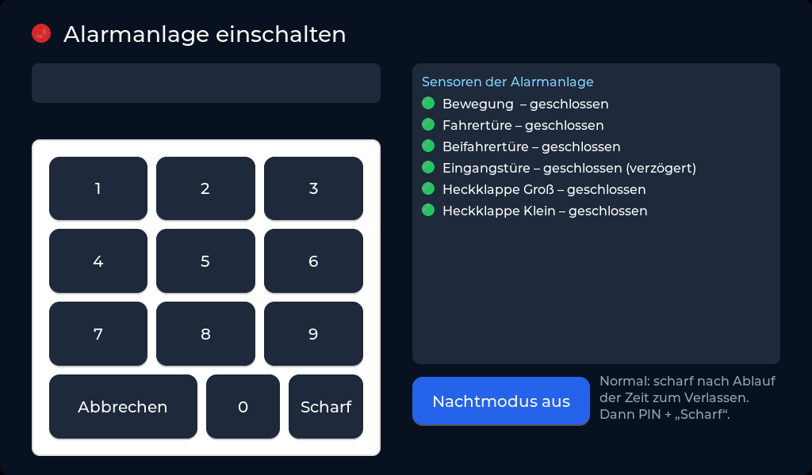
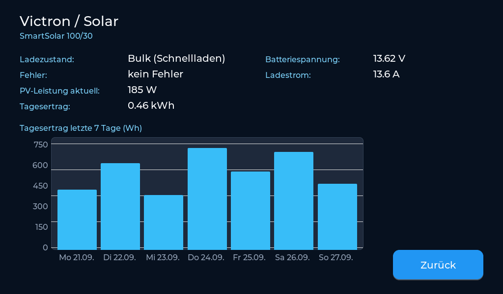
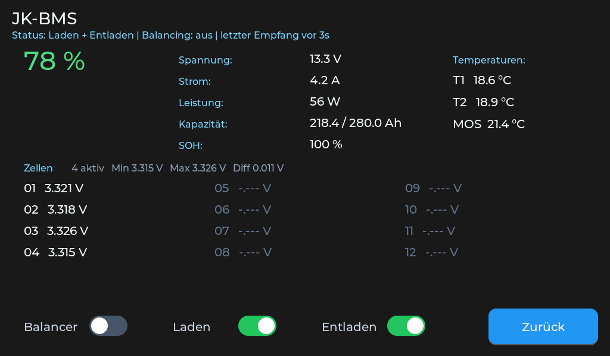
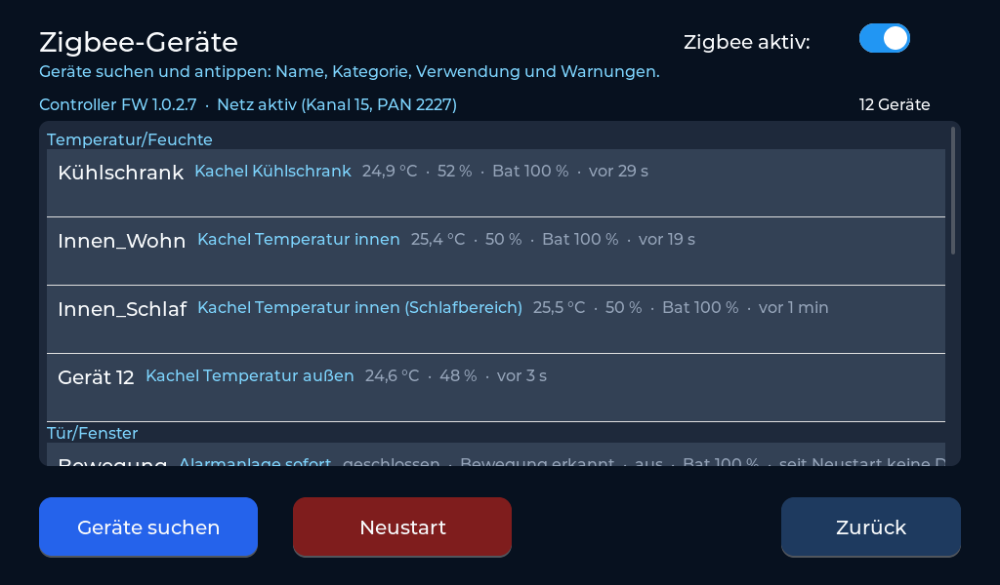
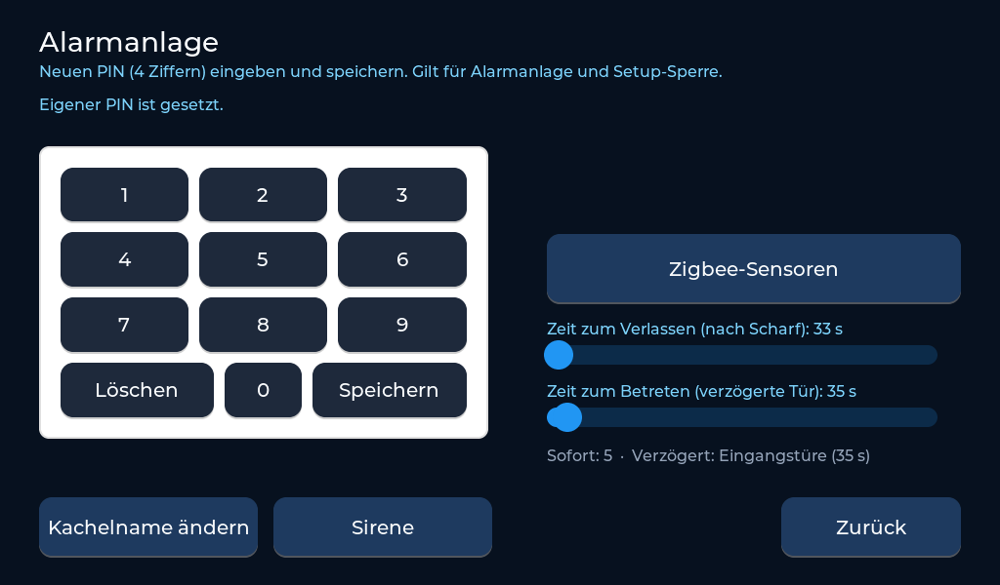
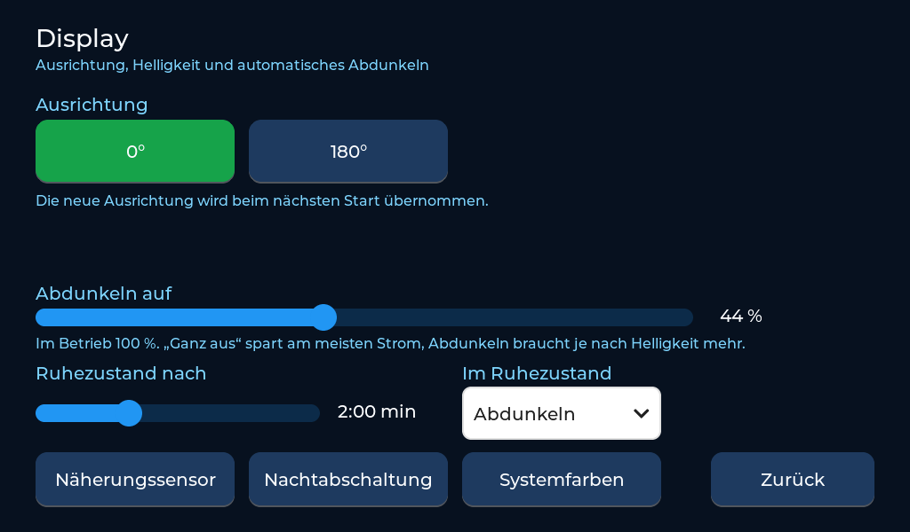
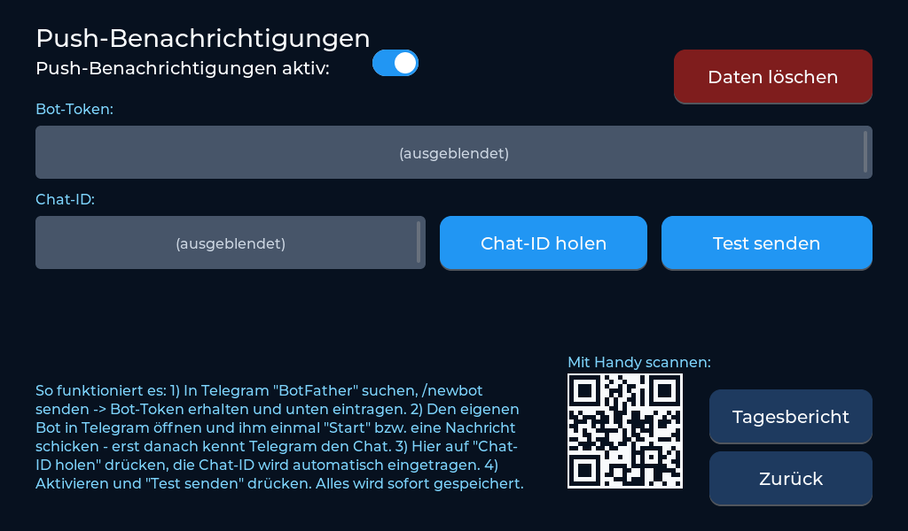
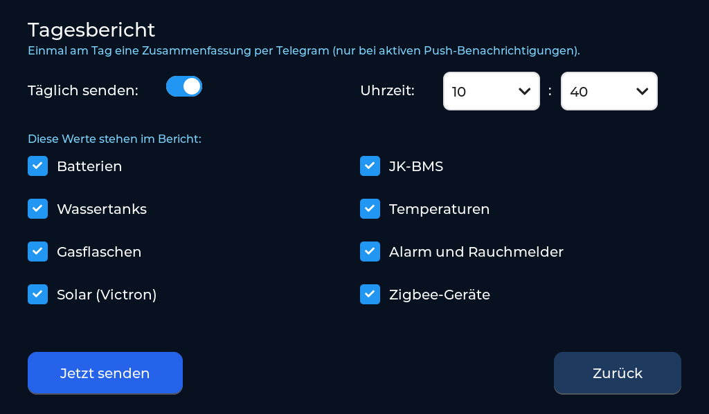
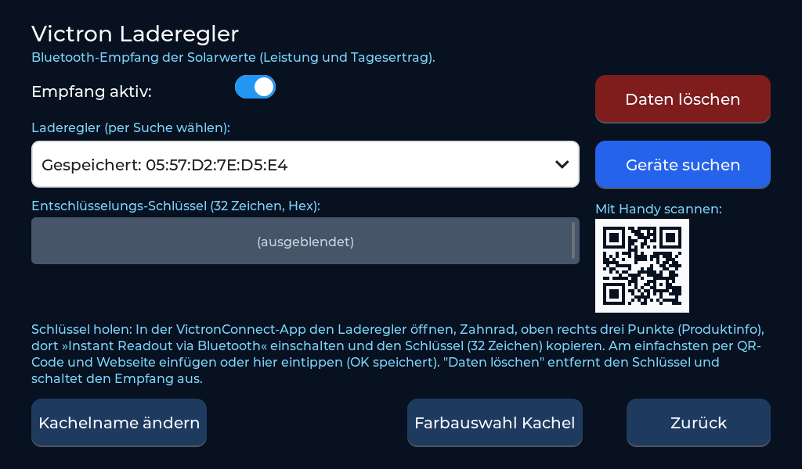

# Wohnmobil-Display – dein Wohnmobil immer im Blick

**Alles wird überwacht – und du bekommst eine Nachricht aufs Handy, wenn etwas nicht stimmt.**

Ein 7-Zoll-Touchdisplay, das rund um die Uhr auf dein Wohnmobil aufpasst:

- 🔋 **Spannung und Ladezustand** von Starter- und Aufbau-Batterie, jede einzelne Zelle des JK-BMS
- ☀️ **Solarertrag** vom Victron-Laderegler, heute und die letzten 7 Tage
- 💧 **Frisch- und Abwasser** – Warnung, bevor der Tank leer bzw. voll ist
- 🔥 **Gasflaschen** in Prozent – Warnung, bevor das Gas ausgeht
- 🌡️ **Temperaturen** innen, außen und im Kühlschrank – Warnung bei zu warm oder zu kalt
- 🚨 **Alarmanlage** mit Tür-, Fenster- und Bewegungsmeldern, **Rauch- und Gasmelder** rund um die Uhr
- 📱 **Push-Nachrichten per Telegram** für jede Warnung – du entscheidest, worüber du informiert werden willst
- 🗓️ **Tagesbericht per Telegram:** einmal am Tag zur Wunschzeit alle wichtigen Werte aufs Handy – Batterien, Tanks, Gas, Solar, Temperaturen, Alarm (ab dem nächsten Update)
- 📡 **Sensor offline oder Batterie schwach?** Auch das meldet das Display

Es ersetzt das originale Schaudt-Bedienteil **LT 100** und nutzt dessen **vorhandene Stecker und Kabel**.
Zum Ausprobieren läuft es **72 Stunden kostenlos und ohne Einschränkung**.


**Inhalt:** [Funktionen](#funktionen) · [Bedienung](#bedienung) · [Hardware](#hardware) · [Einkaufsliste](#einkaufsliste) ·
[Installation](#1-installation) · [Testzeit](#2-erster-start-testzeit) · [Freischalten](#3-freischalten) · [Updates](#4-updates)

## Funktionen

| Bereich | Was das Display kann |
|---|---|
| **Batterien** | Motor- und Aufbau-Batterie, JK-BMS mit allen 12 Zellen, Temperaturen und Ladezustand (Bluetooth) |
| **Solar** | Victron-MPPT-Laderegler: Leistung, Tagesertrag, Verlauf der letzten 7 Tage (Bluetooth) |
| **Wasser** | Frischwasser über den Original-Geber oder Ultraschall, Abwasser über die Original-Elektrodenstäbe |
| **Pumpe** | Wasserpumpe per Fingertipp ein/aus, automatisch gesperrt bei scharfer Alarmanlage |
| **Gas** | Zwei Gasflaschen mit Mopeka-Pro-Sensoren in Prozent (Bluetooth) |
| **Temperatur** | Innen (Wohn- und Schlafbereich), außen, Kühlschrank – über Zigbee-Sensoren oder fest verbaute Fühler |
| **Alarmanlage** | Bis zu 12 Zigbee-Sensoren (Tür/Fenster, Bewegung, Wasser), Nachtmodus, Verlassens-/Eingangszeit, PIN, Summer, Sirene |
| **Rauch / Gas** | Zigbee-Melder, rund um die Uhr überwacht |
| **Landstrom** | Anzeige, ob 230 V anliegen |
| **Push-Nachrichten** | Alarm, Grenzwerte, schwache Batterien, Sensor offline – per Telegram aufs Handy |
| **Tagesbericht** | täglich zur eingestellten Uhrzeit eine Zusammenfassung per Telegram, Inhalte frei wählbar (ab dem nächsten Update) |
| **Komfort** | Kachelnamen und Farben frei wählbar, Nachtabschaltung, Näherungssensor weckt das Display, Einstellen per Handy-Webseite |
| **Updates** | Neue Versionen per WLAN direkt am Display |

## Bedienung

Die komplette **[Bedienungsanleitung (PDF)](docs/Bedienungsanleitung.pdf)** zeigt jede Seite und jede Einstellung.

| Alarmanlage ein-/ausschalten | Victron / Solar mit 7-Tage-Verlauf |
|---|---|
|  |  |
| **JK-BMS mit Zellspannungen** | **Zigbee-Geräte** |
|  |  |
| **Setup Alarmanlage** | **Setup Display** |
|  |  |
| **Setup Push-Nachrichten** | **Tagesbericht per Telegram** |
|  |  |
| **Setup Victron-Laderegler** | |
|  | |

*Victron- und BMS-Seite mit Beispielwerten; Bot-Token, Chat-ID und Victron-Schlüssel sind im Bild ausgeblendet.*

- **Startseite:** 12 Kacheln, oben Uhrzeit, Landstrom, Störmeldungen, Wasserpumpe und Setup.
- **Rote Kachel:** ein eingestellter Grenzwert ist verletzt (z. B. Frischwasser fast leer).
- **Antippen** öffnet Detailseiten (Solar, BMS, Temperaturen) bzw. die PIN-Eingabe der Alarmanlage.
- **Setup:** keine Speichern-Taste – alles wird sofort gespeichert.

## Hardware


Das System besteht aus dem **Display** und der **Steuerplatine** – beide sind nötig.
Die **Relaisplatine** für die Wasserpumpe ist eine Erweiterung, die man weglassen kann.

- **Display:** Waveshare ESP32-S3-Touch-LCD-7B (7 Zoll, 1024×600, WLAN, Bluetooth).
  Bluetooth-Geräte (Victron, Mopeka, JK-BMS) empfängt es direkt.
- **3D-Druckteile** im Ordner [`druck/`](druck/): **Rahmen für das Display** (ersetzt das LT 100 im vorhandenen Ausschnitt), **Halter für Türkontakte** (Sensor und Magnet, verschiedene Sockelhöhen) und **Gehäuse** für Steuer- und Relaisplatine.

### Steuerplatine – notwendig


Die Steuerplatine ist die Verbindung zwischen Display und Fahrzeug. Sie sitzt dort, wo vorher das LT 100 war,
und bekommt **die vorhandenen Original-Stecker** – es muss kein neues Kabel durchs Fahrzeug gezogen werden.
Auf ihr steckt das **ESP32-H2-Board**, das die Messwerte erfasst und das **Zigbee-Funknetz** betreibt.
Mit dem Display ist sie über **ein USB-Kabel** verbunden.

| Anschluss | Was angeschlossen wird |
|---|---|
| **ST1 – EBL** (Original-Stecker) | Stromversorgung 12 V, Hauptschalter **EIN/AUS**, 12-V-Kontrolle, **Landstrom** (230 V liegt an) |
| **ST2 – Frischwasser** (Original-Stecker) | Originaler Tankgeber (Stabsonde) **oder** Ultraschallsensor – umschaltbar per Steckbrücke |
| **ST3 – Abwasser** (Original-Stecker) | Originale Elektrodenstäbe (25 / 50 / 75 / 100 %) |
| **Klemme GRÜN** | Freie grüne Ader im Panelkabel: misst die **Starterbatterie** und schaltet die Relaisplatine |
| **Klemme 5V DISPLAY** | Versorgt das Display – ein eigenes Netzteil ist nicht nötig |
| **Klemme SIRENE** | Alarmsirene (überwacht auf Kurzschluss und offene Leitung) |
| **Klemmen DS18B20** | Fest verbaute Temperaturfühler (z. B. innen, Kühlschrank) |
| **USB** | Verbindung zum Display |

Gemessen werden Starter- und Aufbau-Batterie, 12-V-Kontrolle und Landstrom.
**Ohne Steuerplatine** zeigt das Display nur die Bluetooth-Geräte – Tanks, Hauptschalter, Landstrom,
Pumpe und alle Zigbee-Sensoren (Alarmanlage, Rauchmelder, Temperaturen) funktionieren dann nicht.

### Relaisplatine für die Frischwasserpumpe – optional


Beim originalen LT 100 lässt sich die Wasserpumpe nicht schalten – hier schon:

- **Pumpe per Fingertipp ein/aus** über das Wasserhahn-Symbol oben auf der Startseite.
- **Automatisch aus, wenn die Alarmanlage scharf ist** – kein Wasser läuft unbemerkt, während du weg bist.
- **Anschluss für einen Notschalter**: überbrückt das Relais, falls einmal etwas nicht funktioniert – die Pumpe läuft dann wie früher.
- Die Platine wird am EBL in die Plus-Leitung der Pumpe eingesetzt und über die grüne Ader von der Steuerplatine geschaltet.

**Keine Relaisplatine?** Unter *Setup → Allgemein → Wasserpumpe (Relaisplatine)* ausschalten –
dann verschwinden das Wasserhahn-Symbol und alle Pumpen-Meldungen, alles andere läuft weiter.

**Die Original-Stecker werden einfach umgesteckt – kein neues Kabel durchs Fahrzeug:**

| LT 100 mit den Original-Steckern | Stecker abgezogen |
|---|---|
|  |  |

| Kabel zum EBL (ST1) | EBL 31, Block 3 „Instr.-Tafel“ |
|---|---|
|  |  |

Anschlüsse am Display:


## Einkaufsliste

| Teil | Wofür | Link |
|---|---|---|
| Waveshare ESP32-S3-Touch-LCD-7B (7 Zoll, 1024×600) | Das Display | [Amazon\*](https://www.amazon.de/dp/B0FG354VCN?tag=wohnmobildisp-21) |
| ESP32-H2-DevKitM-1 (N4) | Zigbee und Steuerplatine | [Amazon\*](https://www.amazon.de/dp/B0D8XR48LF?tag=wohnmobildisp-21) |
| Ultraschallsensor JSN-SR04M-2 / AJ-SR04M (wasserdicht) | Frischwasser (optional, statt Original-Geber) – funktioniert ohne Löten, wird automatisch erkannt | [Amazon\*](https://www.amazon.de/dp/B0FPPTTHTJ?tag=wohnmobildisp-21) |
| frient Smoke Alarm (Zigbee-Rauchmelder mit Sirene) | Rauchmelder, auch als Alarm-Sirene nutzbar | [Amazon\*](https://www.amazon.de/dp/B08WXV3G8P?tag=wohnmobildisp-21) |
| SONOFF SNZB-02B (Zigbee-Temperatur/Luftfeuchte) | Temperatur innen, außen, Kühlschrank | [Amazon\*](https://www.amazon.de/dp/B0H4QJQFKM?tag=wohnmobildisp-21) |
| SONOFF SNZB-04P (Zigbee-Tür-/Fensterkontakt) | Alarmanlage | [Amazon\*](https://www.amazon.de/dp/B0DD3SQYV9?tag=wohnmobildisp-21) |
| Zigbee-Bewegungsmelder | Alarmanlage | *folgt* |
| Mopeka Pro (Ultraschallsensor mit Magnet) | Gasflaschen-Füllstand (optional) | [Amazon\*](https://www.amazon.de/dp/B0GCD1Q4HP?tag=wohnmobildisp-21) |
| VL53L0X-Näherungssensor (6 Stück) | Display wird hell, wenn jemand davor steht (optional) | [Amazon\*](https://www.amazon.de/dp/B0D3PRSV3B?tag=wohnmobildisp-21) |

\* Werbelink: Als Amazon-Partner verdiene ich an qualifizierten Verkäufen. Für dich ändert sich am Preis nichts.

## 1. Installation

Die Firmware wird direkt im Browser installiert – ohne Download und ohne Zusatzprogramm.

**Du brauchst:**
- ein USB-Datenkabel (ein reines Ladekabel funktioniert nicht),
- einen Computer mit **Google Chrome** oder **Microsoft Edge**,
- kein anderes Programm, das gerade auf den USB-Anschluss zugreift (z. B. Arduino IDE, serieller Monitor).

**So geht's:**
1. Öffne die Installer-Seite: **[wohnmobil-display.github.io/Wohnmobil-Display](https://wohnmobil-display.github.io/Wohnmobil-Display/)**
2. Schließe das Display per USB-C an und klicke auf **Installieren**.
3. Wähle im Fenster den Eintrag deines Displays (z. B. „USB JTAG/serial debug unit“ oder „USB Single Serial“) und klicke auf **Verbinden**.
4. Bestätige die Installation und warte, bis sie fertig ist. Kabel nicht abziehen, Browser nicht schließen.
5. Das Display startet danach von selbst neu. Falls nicht: kurz vom Strom trennen und wieder anschließen.

**Steuerplatine:** Das ESP32-H2-Board bekommt seine Firmware ebenfalls über die Installer-Seite –
einmal **vor dem Einbau**, per USB an der Buchse „USB“ des Boards (Knopf „Steuerplatine installieren“).

> Wird kein Gerät angezeigt, probiere ein anderes Kabel oder einen anderen USB-Anschluss.
> Stecke das Display kurz ab und wieder an und wähle dann den neu erschienenen Eintrag.

## 2. Erster Start: Testzeit

Beim ersten Start zeigt das Display den Bildschirm **Freischaltung** mit zwei Werten:

- **Chip-ID**, z. B. `AA:BB:CC:DD:EE:FF`
- **Freigabecode**, z. B. `1234`

Darunter steht die fertige Zeile zum Freischalten, z. B.:

```
AA:BB:CC:DD:EE:FF 1234
```

Mit **„Test starten (72 Std.)“** kannst du das Display 72 Betriebsstunden lang kostenlos und uneingeschränkt nutzen.
Gezählt wird nur die Zeit, in der das Display eingeschaltet ist. Die restliche Testzeit steht oben in der Kopfzeile.
Nach Ablauf zeigt das Display nur noch den Freischalt-Bildschirm.

## 3. Freischalten

Das Wohnmobil-Display ist ein privat entwickeltes Hobbyprojekt. Für die dauerhafte Nutzung ist ein persönlicher,
6-stelliger **Freischaltcode** nötig. Er kostet einmalig **29 €** und gilt für immer – auch nach Neustarts und Updates.

1. Öffne den PayPal-Link: **[paypal.com/ncp/payment/MHXFBPU9TVV2L](https://www.paypal.com/ncp/payment/MHXFBPU9TVV2L)**
2. Trage im Feld **„Chip-ID + Freigabecode“** die Zeile vom Display ein – genau so, wie sie dort steht:
   `AA:BB:CC:DD:EE:FF 1234`
3. Nach Eingang der Zahlung bekommst du den Freischaltcode per E-Mail, in der Regel **innerhalb von 24 Stunden**.
4. Gib den Code am Display ein und bestätige mit **OK**. Fertig – das Display ist dauerhaft freigeschaltet.

Den Freischalt-Bildschirm erreichst du während der Testzeit auch über **Setup → Allgemein → Freischaltung**.

> Feld beim Bezahlen vergessen? Schick die Zeile einfach an **wohnmobil.display@gmail.com**.
>
> Nach jeder dritten falschen Eingabe wird die Eingabe für einige Stunden gesperrt – den Code bitte genau übernehmen.

## 4. Updates

Freigeschaltete Displays holen neue Versionen selbst über WLAN – **für das Display und für die Steuerplatine**:
**Setup → Allgemein → Update → Installieren.**
Die Steuerplatine wird dabei über das USB-Kabel vom Display aus aktualisiert – nichts muss ausgebaut werden.
Deine Einstellungen bleiben dabei erhalten. Startet eine neue Version einmal nicht richtig,
kehrt das Display automatisch zur vorherigen Version zurück.

Was sich geändert hat, steht bei den [Versionen (Releases)](https://github.com/Wohnmobil-Display/Wohnmobil-Display/releases).

## Hilfe bei Verbindungsproblemen

- Nur Chrome oder Edge verwenden.
- Ein anderes USB-Kabel und einen anderen USB-Anschluss probieren.
- Alle Programme schließen, die den USB-Anschluss benutzen könnten.
- Display kurz abziehen und wieder anschließen, Installer-Seite neu laden.

## Manuelle Installation

Falls die Installer-Seite nicht funktioniert: Unter [Releases](https://github.com/Wohnmobil-Display/Wohnmobil-Display/releases)
liegt die Datei `Wohnmobil-Display-FULL.bin`. Sie wird mit einem eigenen Flash-Programm an **Adresse 0x0** geschrieben.
Die Datei `Wohnmobil-Display.bin` ist nur für Updates gedacht.

## Hinweis

Das Wohnmobil-Display ist ein privates DIY-Projekt ohne Firma dahinter und steht in keiner Verbindung zu Schaudt,
Waveshare, Victron, Mopeka oder anderen Herstellern der unterstützten Geräte. Die Nutzung erfolgt auf eigene Verantwortung.

Kontakt: **wohnmobil.display@gmail.com**
